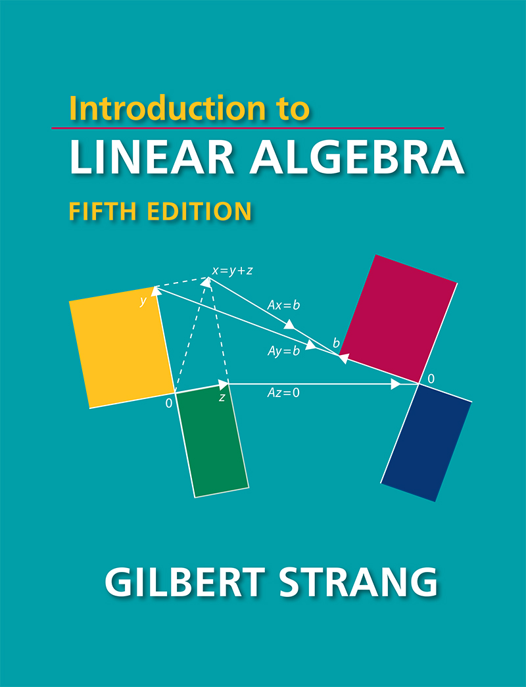

# 参考书目
### [1]  Signal and Systems,Second Edition:Alan S Oppenheim

<figure markdown="span">
    {width="500"}
</figure>

### [2]  Introduction to Linear Algebra,Fifth Edition:Gilbert Strang  

<figure markdown="span">
    {width="500"}
</figure>

### [3]  Modern Control Engineering,Fifth Edition:Katsuhiko Ogata 

<figure markdown="span">
    {width="500"}
</figure>

### [4]  Modern Control Systems,Thirteenth Edition:Richard C.Doff Robert H.Bishop

<figure markdown="span">
    {width="500"}
</figure>

### [5]  Digital Control System Analysis & Design,Fourth Edition Charles L.Philips H.Troy Nagle Aranya Chakrabortty  

<figure markdown="span">
    {width="500"}
</figure>
